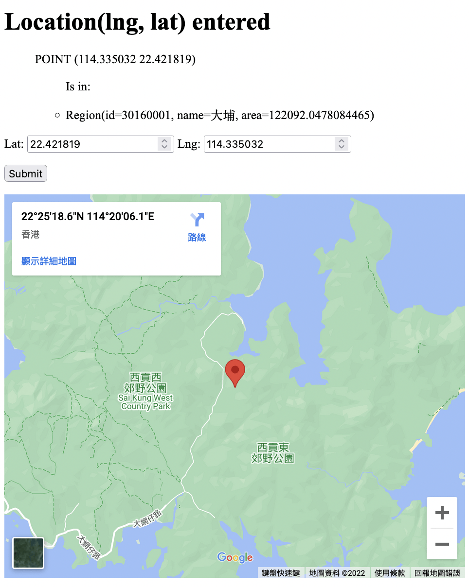
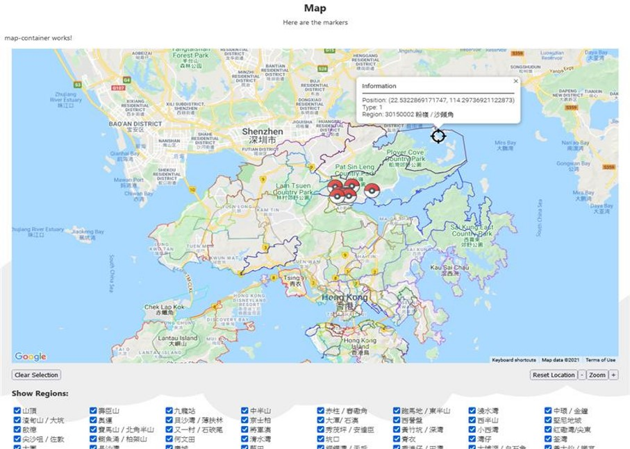
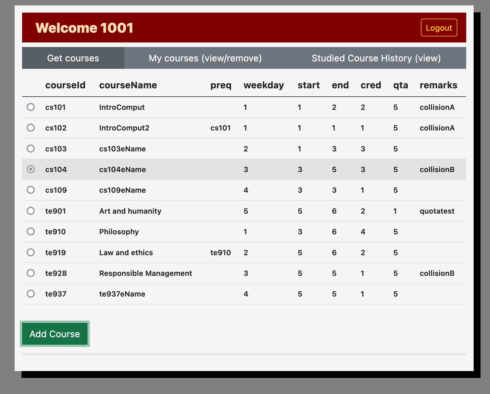

Some of my past projects.  
Hosted on Google Cloud Platform.

* TOC
{:toc}

## Bachelor in Computer Science Graduation Thesis (2022)

### Application of improved approximate string search on Simplified/Traditional Chinese Address 繁簡漢字地址的模糊搜索研究與實踐

Fun fact: My thesis was written in pandoc markdown.

Based on NLP researches and information retrieval theories to improve Chinese information search use cases typo tolerance. 
Demonstration based on API wrapper around a single node Elasticseach deployment, Kibana data view and a Python wxwidget GUI.

This topic can benefit problem in other opensource project as well.  For example according to the discussion for issue on meilisearch.

- {: width="450"}

### GUI Demo

{: width="450"}

### Video Demo

<iframe width="560" height="315" src="https://www.youtube.com/embed/A_k3z66zZbU" title="YouTube video player" frameborder="0" allow="accelerometer; autoplay; clipboard-write; encrypted-media; gyroscope; picture-in-picture" allowfullscreen></iframe>

 

## Geofencing Project (2021)

{: width="450"}

Geofencing API built during internship.  Using Java Spring Boot, GeoJSON spatial region data and JTS library
- [Try it](https://geofencing-springboot-dot-second-pursuit-310310.df.r.appspot.com/geofence?lat=22.421819&lng=114.335032)
- [API](https://geofencing-springboot-dot-second-pursuit-310310.df.r.appspot.com/api/geofence?lat=22.421819&lng=114.335032)

## Geospatial data visualization (2021)

[{: width="450"}](images/pokemon.jpg)

This is an Angular component project during internship.  Built using Angular and Google Maps API to visualize datapoints. 

## e-student course selection (2020)

{: width="450"}

Course selection web project in Vue2, with java REST API backend, SQLite database
- possible usernames:{1001,3001,3002}
- [Try it](https://second-pursuit-310310.df.r.appspot.com/) 
- [source](https://github.com/ICHx/DBS-selectCourse)

## College info database management project(2021)
{: width="450"}

Database CRUD management, in Vue3 and Java backend, using mysql database.
- Sample Account=(netid=122235d, pin=122235dChan)
- [Try it](http://gcp-wormfeed.duckdns.org:8002/) 
- [source](https://github.com/ICHx/dad21_finalProj)

## Data visualization of electric bill (2021)
This experiment will try to mine my own electric usage to visualize and examine usage habit.  Using pandas, scikit, matlibplot in python.

- [source](https://github.com/ICHx/21dw_electricityUsage_conda)

## More

- [Github](https://github.com/ICHx)
